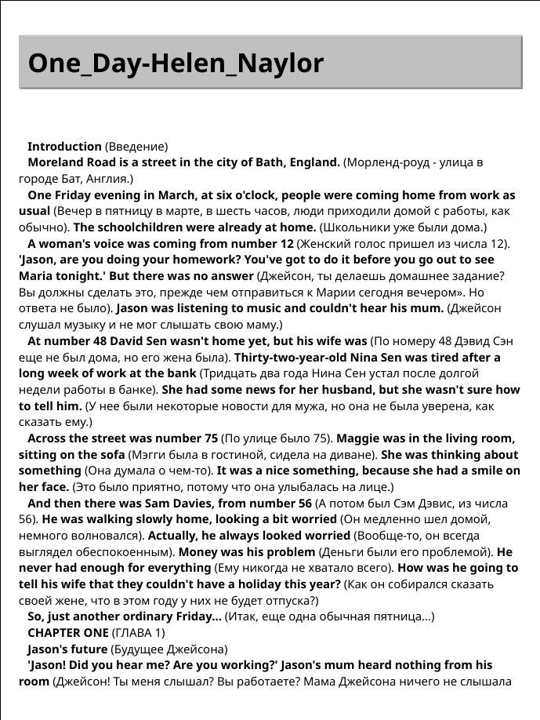

# Параллельный переводчик FB2-формат

```
composer require nigo/fb2-parallel-translator
```

## Класс ``Fb2ParallelDocumentGenerator``

```php
$generator = new Fb2ParallelDocumentGenerator('lang', 'path_to_save');
```

Класс ``Fb2ParallelDocumentGenerator`` принимает два параметра при создании,
язык и путь к папке, куда будет сохранятся файл.

### generateByFile()

```php
$generator->generateByFile('file_for_translate');
```

## Перевод


Метод принимает путь до файла для перевода и возвращет ``false``,
если файл не создался, или размер созданного файла.

### setNewTranslator()

Класс ``Fb2ParallelDocumentGenerator`` в конструкторе создает переводчик.

```php
$this->translator = new LibreTranslator();
```

Для изменения переводчика можно использовать следующий метод

```php
public function setNewTranslator(TranslatorAbstract $translator): void
{
    $this->translator = $translator;
}
```

В проекте реализован класс ``LibreTranslator``,
который работает на основе API из этого [репозитория](https://github.com/LibreTranslate/LibreTranslate).

Чтобы создать свою реализацию переводчика, нужно создать класс, который будет занаследован от

```php
abstract class TranslatorAbstract
{
    protected bool $logState;

    /** Ключ, по которому можно получить перевод от ответа API*/
    protected string $translatedTextKey = '';

    /** API */
    protected string $uri = '';
    
    abstract public function translate(string $text, mixed $lang);

    public function __construct(bool $logState = false)
    {
        $this->logState = $logState;
    }
}
```

далее нужно будет создать свою реализацию метода ``translate()``.

Иногда API может присылать не то, что мы хотим, и для более удобной отладки, ответы,
которые не имеют статус ``200``, могут записываться в файл ``./storage/logs/day_moth_year.txt``,
для этого при создании переводчика нужно передать ``true`` в параметр ``logState``.

```php
new LibreTranslator(true);
```

Изменить состояние для логов с помощью метода
```php
public function setLogState(bool $state): void
{
    $this->logState = $state;
}
```

Или из класса ``Fb2ParallelDocumentGenerator``

```php
public function setLogStateForTranslator(bool $state): void
{
    $this->translator = new LibreTranslator($state);
}
```

Тестовые тексты для перевода берутся из ``./storage/test_doc/``. One_Day-Helen_Naylor.txt большой текст и text/txt маленький